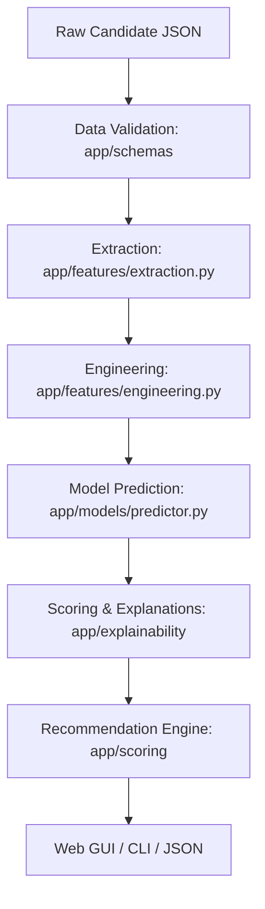

# Boutique Candidate Scoring System

> **Prototype Assessment** — A production-minded prototype for evaluating prospective influencers as Boutiqaat Boutique owners.

🎥 **[Watch the Video Demo](https://drive.google.com/file/d/1bhkbEvSOMp8ob2frzlwjF7caeT8APEvd/view?usp=sharing)**

---

## 1. Project Overview

This system scores prospective influencers on their likely fitness as Boutiqaat Boutique owners. It takes raw public profile signals (audience composition, engagement metrics, content alignment) and produces:

1. A **fit score** from 0–100
2. The **key signals** driving the score (positive and negative)
3. **Risks** and negative signals
4. A concrete **recommendation**: `APPROVE`, `REVIEW`, or `DECLINE`
5. A clear **business action** for Celebrity Management

## 2. Business Problem

Boutiqaat's growth depends on influencer-owned storefronts ("Boutiques"). GCC creators and celebrities curate and sell products as commissioned Boutique owners. Celebrity Management has **limited onboarding capacity** — we need to identify which prospective influencers are most likely to be a strong Boutique fit *before* spending onboarding effort.

## 3. Why This Problem Matters

Onboarding the wrong influencer wastes Celebrity Management's time and damages brand reputation. Onboarding the right influencer drives GMV and strengthens Boutiqaat's market position. A systematic scoring system ensures:

- **Consistency** — every candidate is evaluated against the same criteria
- **Transparency** — stakeholders can see *why* a candidate scored high or low
- **Efficiency** — Celebrity Management focuses capacity on the strongest candidates

## 4. Solution Architecture & Module Reference



The system is designed as a clean pipeline with explicit separation of concerns:

- **`app/schemas/` (Data Validation Layer)**: Uses Pydantic to enforce strict type checking and constraint validation on incoming profiles.
- **`app/features/` (Feature Pipeline Layer)**: Safely extracts raw data and contains the core mathematical logic for computing derived features like `engagement_quality` and `gcc_market_fit`. **Every function here is extensively documented with its mathematical formula.**
- **`app/models/` (Machine Learning Layer)**: Contains training logic (`train.py`) and a singleton prediction wrapper (`predictor.py`) utilizing scikit-learn.
- **`app/scoring/` (Business Logic Layer)**: Maps probabilities to fit scores and handles the business tiering logic (`APPROVE`, `REVIEW`, `DECLINE`).
- **`app/explainability/` (Transparency Layer)**: Deconstructs the Logistic Regression model's predictions into exact coefficient contributions, ensuring stakeholder trust.
- **`app/web/` (Presentation Layer)**: A lightweight Flask server exposing the scoring pipeline via a beautiful, glassmorphic GUI.
- **`app/config.py` (Configuration)**: The central brain of the system's business rules. All weights and thresholds are stored here for easy auditing.

## 5. Features

- ✅ Pydantic-validated input with safe defaults and boundary checks
- ✅ 10 engineered features with documented formulas
- ✅ Interpretable Logistic Regression model
- ✅ Coefficient-based explainability (technically valid decomposition)
- ✅ Three-tier recommendation system with actionable next steps
- ✅ **Premium Web GUI** with interactive score gauge, glassmorphic UI, and sample testing
- ✅ CLI with text and JSON output formats
- ✅ Markdown report generation
- ✅ Risk identification (rule-based, complements model)
- ✅ Data quality and model confidence assessment
- ✅ 86 deterministic unit tests
- ✅ Docker support for reproducibility
- ✅ **Exhaustive code documentation** (NumPy-style docstrings on all functions and classes)

## 6. Feature Engineering

All 10 model features are derived from raw profile signals. Formulas and business rationale:

| # | Feature | Formula | Rationale |
|---|---------|---------|-----------|
| 1 | `engagement_rate` | (likes + comments) / followers | Overall interaction intensity |
| 2 | `like_rate` | likes / followers | Passive engagement signal |
| 3 | `comment_rate` | comments / followers | Active engagement (higher effort) |
| 4 | `view_follower_ratio` | views / followers | Content reach beyond follower base |
| 5 | `category_fit` | Weighted: beauty(0.35) + fashion(0.30) + luxury(0.20) + lifestyle(0.15), normalised to [0,1] | Alignment with Boutiqaat's core categories |
| 6 | `gcc_market_fit` | gcc_audience_pct / 100 | Primary market alignment |
| 7 | `audience_quality` | Weighted blend of GCC(0.40), female(0.25), Saudi(0.20), UAE(0.15) audience % | Composite audience composition |
| 8 | `engagement_quality` | Blend of capped engagement rate (0.50) + comment quality (0.50) | Quality over volume |
| 9 | `sponsorship_penalty` | Linear ramp from 1.0 (no penalty) to 0.70 (max penalty) above 10% sponsored | Over-commercialised audiences may have weaker trust |
| 10 | `content_consistency` | Direct passthrough of consistency score | Reliable posting cadence |

All weights are defined in `app/config.py` for easy auditing and adjustment.

### Key Design Decision: Follower Count Is NOT a Feature

Follower count is deliberately excluded as a direct model input. A candidate with 2M followers but poor GCC audience and weak category fit should score below a 300K follower candidate with excellent GCC fit and beauty/fashion alignment. The system optimises for *probable Boutique fit*, not popularity.

## 7. Data Strategy

### Why Synthetic Data?

Real Boutiqaat onboarding outcome data was not available. Rather than scrape social media (brittle, rate-limited, potentially violates ToS) or fabricate "real" data, we:

1. Generated 1,000 synthetic candidates with realistic distributions
2. Created success labels using a transparent probabilistic mechanism
3. Clearly labelled everything as synthetic

> ⚠️ **All validation metrics in this project describe prototype/model behaviour on synthetic data only. They do NOT prove real-world predictive performance.**

## 8. Model Choice: Why Logistic Regression?

We deliberately chose a **Logistic Regression** pipeline over a black-box model (like Random Forest or XGBoost).

| Consideration | Decision |
|--------------|----------|
| **Interpretability** | Coefficients directly explain each feature's influence on the log-odds. |
| **Dimensionality** | 10 engineered features — too few to justify complex models. |
| **Training speed** | Trains in milliseconds, enabling fast iteration. |
| **Explainability** | Per-feature contribution decomposition is exact (not approximate like SHAP). |

## 9. Validation Methodology

| Metric | Value | Purpose |
|--------|-------|---------|
| ROC-AUC (test) | 0.76 | Discrimination ability across all thresholds |
| ROC-AUC (5-fold CV) | 0.79 ± 0.03 | Stability across data splits |
| Precision | 0.69 | Proportion of predicted positives that are correct |
| Recall | 0.69 | Proportion of actual positives correctly identified |
| F1 | 0.69 | Balance of precision and recall |

## 10. Explainability

For every candidate, the system decomposes the model's decision into per-feature contributions.

### How It Works

For Logistic Regression, the log-odds are:
`logit(p) = β₀ + β₁·x₁ + β₂·x₂ + … + βₙ·xₙ`

Each term `βᵢ·xᵢ` (coefficient × scaled feature value) is the contribution of feature *i*. We:
1. Compute raw contributions in log-odds space
2. Normalise so their absolute values sum to `|score − 50|`
3. Preserve the sign: positive = helped, negative = hurt
4. Map feature names to business-friendly labels

## 11. Recommendation Logic

| Score | Recommendation | Action |
|-------|---------------|--------|
| ≥ 70 | **APPROVE** | Prioritize for Celebrity Management outreach |
| 50–69 | **REVIEW** | Request deeper audience analytics before allocating capacity |
| < 50 | **DECLINE** | Do not prioritize for onboarding at this stage |

## 12. How to Run

### Prerequisites
- Python 3.11+ (managed via Conda or virtualenv)
- pip

### Setup

```bash
# Clone the repository
git clone <repo-url>
cd boutique-candidate-scoring

# Install dependencies
pip install -r requirements.txt

# Train the model (generates synthetic data + trains pipeline)
python -m app.main --train
```

### Option A: Run the Premium Web GUI (Recommended)

```bash
# Start the Flask development server
python -m app.web.server

# Open http://localhost:5000 in your browser
```

### Option B: Run the CLI

```bash
# Score a candidate
python -m app.main --input data/sample_candidate.json

# JSON output
python -m app.main --input data/sample_candidate.json --format json

# Generate a Markdown report
python -m app.main --input data/sample_candidate.json --report reports/sample_report.md
```

## 13. How to Run Tests

```bash
python -m pytest tests/ -v
```
All 86 tests should pass in < 1 second.

## 14. Project Structure

```
boutique-candidate-scoring/
├── app/
│   ├── __init__.py
│   ├── main.py                  # CLI entry point
│   ├── config.py                # Central configuration
│   ├── reporting.py             # Markdown report generation
│   ├── schemas/                 # Data validation (Pydantic)
│   ├── features/                # Extraction and Engineering
│   ├── models/                  # Training and prediction
│   ├── scoring/                 # Score conversion & thresholds
│   ├── explainability/          # Coefficient decomposition
│   └── web/                     # Flask GUI frontend and server
├── data/                        # Sample and synthetic data
├── reports/                     # Pre-generated reports
├── tests/                       # 86 comprehensive unit tests
├── README.md                    # This documentation file
├── requirements.txt
├── .env.example
├── .gitignore
└── Dockerfile
```

## 15. Limitations & Future Improvements

**Current Limitations:**
- Uses synthetic data (cannot prove real-world accuracy without true outcomes).
- Audience authenticity is assumed (requires external fake-follower detection).
- Single-point-in-time scoring (does not track temporal growth).

**Future Improvements:**
- Retrain on actual success/failure labels from historical onboarding.
- A/B test scoring thresholds against business metrics.
- Integrate directly with a CRM for automated lead scoring.

---
*Built as a practical assessment prototype. The architecture, testing, and documentation are production-minded; the data and validation are honestly scoped to what's achievable without real onboarding outcomes.*
